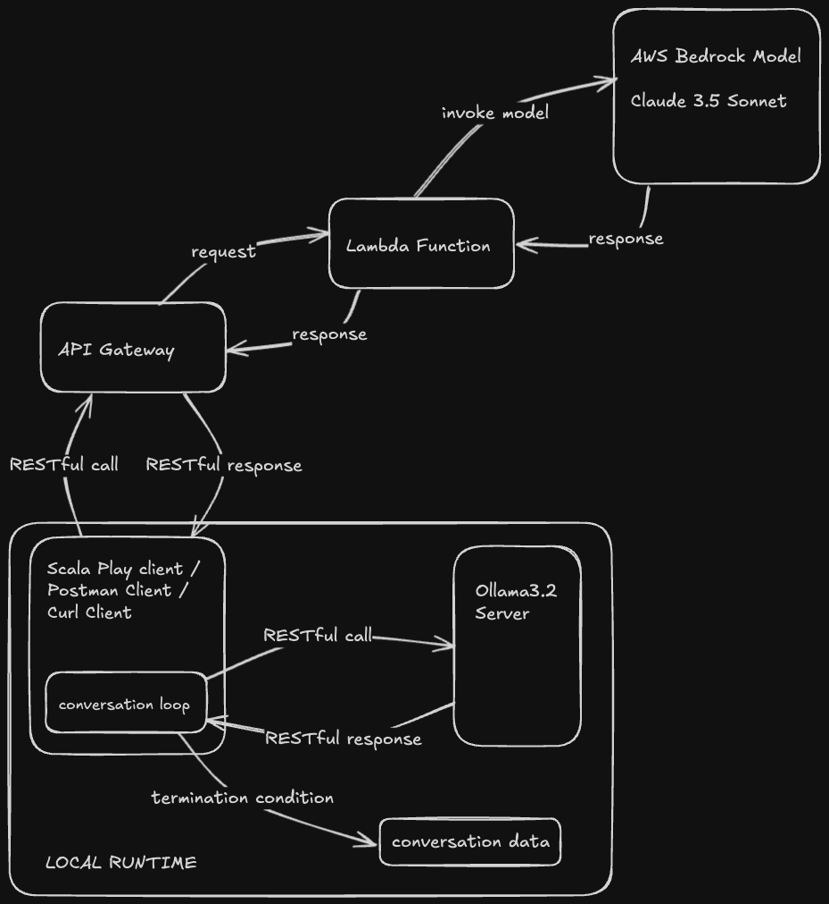

# Deploying a Conversational Agent on the Cloud and Conversing with Ollama

Name - Gautham Satyanarayana <br />
Email - gsaty@uic.edu <br />
UIN - 659368048

## Introduction
As part of the CS441 course, we build deploy the trained model from HW2 as a RESTful api 
using the Play framework. Along with deploying the trained model on an api endpoint, we use 
Amazon Bedrock and AWS Lambda to expose a foundational LLM base model over AWS API Gateway.
Additionally, an api endpoint is exposed to make the AWS bedrock model converse with a local Ollama
model and record the conversation.

Video Link: 

## Frameworks
1. Scala 2.13
2. sbt 1.10
3. REST - Play
4. Deeplearning4j

## Configuration
1. AWS Bedrock Model - Anthropic Claude 3.5 Sonnet
2. Local Ollama server - Ollama 3.2
3. Conversation Reply Count - 5 messages
4. Local Model Output sentence length - 10 words

## Data Flow and Logic

## AWS Deployment
The deployed API Gateway connected to Lambda that is invoking a bedrock runtime is accessible at - 
```angular2html
https://5lz5bv3g1h.execute-api.us-east-2.amazonaws.com/prod/hw3
```
you can run the following curl command to test it
```angular2html
curl -X POST https://5lz5bv3g1h.execute-api.us-east-2.amazonaws.com/prod/hw3 \
    -H "Content-Type: application/json" \
    -d '{"prompt": "<your_prompt_here>"}'
```
and the lambda function can be found in `lambda_function.py`
## Test Suite
Test cases can be found in the `test` folder, to run tests, run
```angular2html
sbt test
```
## Results
You can generate the results of the conversation with Ollama through the api endpoint `localhost:9000/conversation` in the postman collection after running the app.

## Usage
Clone this repository, and
1. Make sure Ollama server is running
```angular2html
ollama run llama3.2
```
2. Install dependencies
```angular2html
sbt update
```
3. Run the Play application
```angular2html
sbt run
```
4. Import the postman collection found in `hw3.postman_collection.json` and test out the endpoints in postman.
```angular2html
GET  /health
POST /modelLocal
POST /modelExternal
POST /converse
```